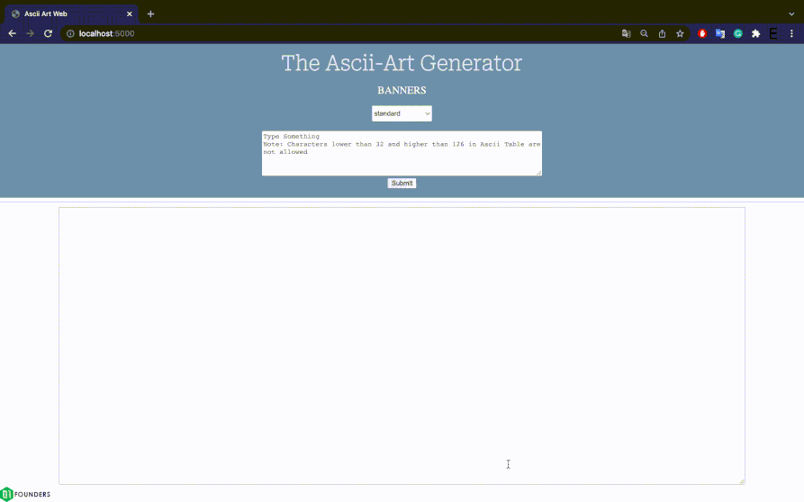

# <u><b>ASCII Art Web</b></u>
The purpose of this project is to create a simple website that displays a graphical representation of ASCII.   

## The Description
In this website, the user writes a text using printable characters from ASCII table and submits to display as a graphical representation. The user can choose one of the three graphical templates named "standard", "shadow" and "thinkertoy". 

=================================================================  

## Usage

=================================================================  

## Authors
First Name
------------ | -------------
Keivon
Elif
Aiden
